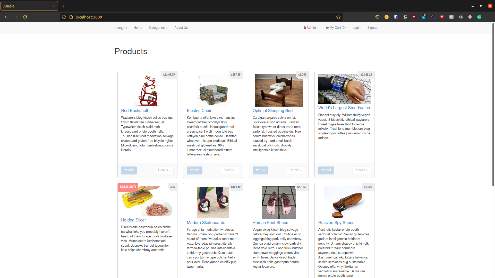
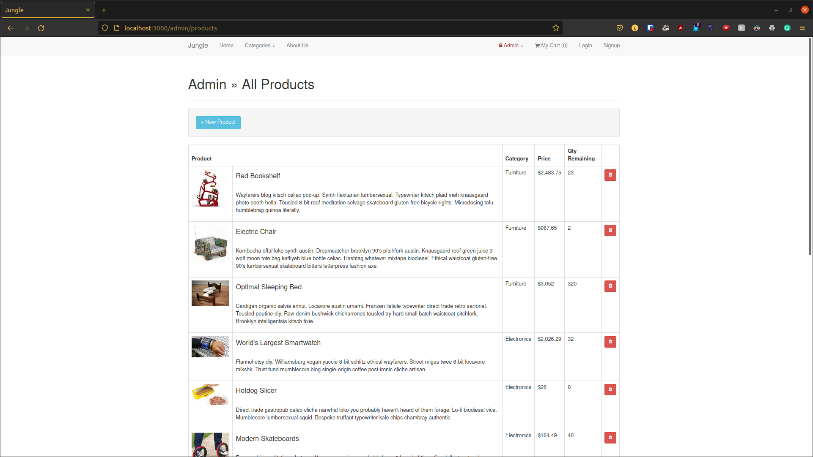
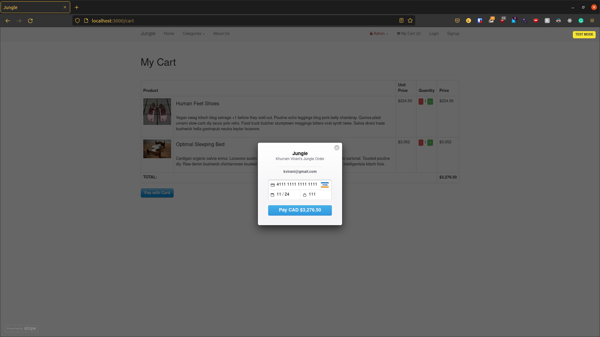
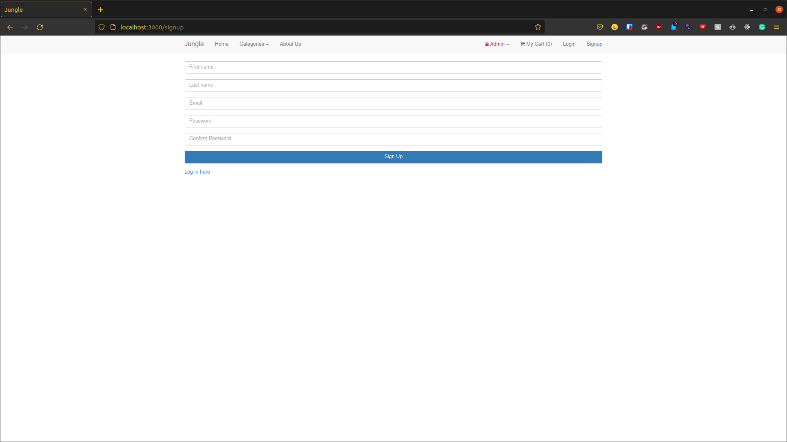

# Jungle

A mini e-commerce application built with Rails 4.2 for purposes of teaching Rails by example.

This project was done during my web development bootcamp at Lighthouse Labs to learn Ruby/Rails

---
# Stack
- Ruby
- Rails
- ERB
- Capybara, Poltergeist, PhantomJS, DatabaseCleaner

---

# Features Implemented
### Adding new pages:
1. Category Page
2. Admin Dashboard
3. Home Page
4. Order Details Page

### Adding new features:
1. Sold Out Badge
2. Allowing Admins to Create New Products and Categories
3. User Authentication
4. Signup

### Bug fixes
1. Added Basic Admin Security
2. Prevent Empty Cart Checkout

### Testing
1. User Login/Signup
2. Home Page and Associated Links
3. Testing 'Add to Cart' Functionality

---

# Screenshots

---

## Additional Steps for Apple M1 Machines

1. Make sure that you are runnning Ruby 2.6.6 (`ruby -v`)
2. Install ImageMagick `brew install imagemagick imagemagick@6 --build-from-source`
3. Remove Gemfile.lock
4. Replace Gemfile with version provided [here](https://gist.githubusercontent.com/FrancisBourgouin/831795ae12c4704687a0c2496d91a727/raw/ce8e2104f725f43e56650d404169c7b11c33a5c5/Gemfile)
---

## Setup

1. Run `bundle install` to install dependencies
2. Create `config/database.yml` by copying `config/database.example.yml`
3. Create `config/secrets.yml` by copying `config/secrets.example.yml`
4. Run `bin/rake db:reset` to create, load and seed db
5. Create .env file based on .env.example
6. Sign up for a Stripe account
7. Put Stripe (test) keys into appropriate .env vars
8. Run `bin/rails s -b 0.0.0.0` to start the server
---

## Stripe Testing

Use Credit Card # 4111 1111 1111 1111 for testing success scenarios.

More information in their docs: <https://stripe.com/docs/testing#cards>

---

## Dependencies

* Rails 4.2 [Rails Guide](http://guides.rubyonrails.org/v4.2/)
* PostgreSQL 9.x
* Stripe
